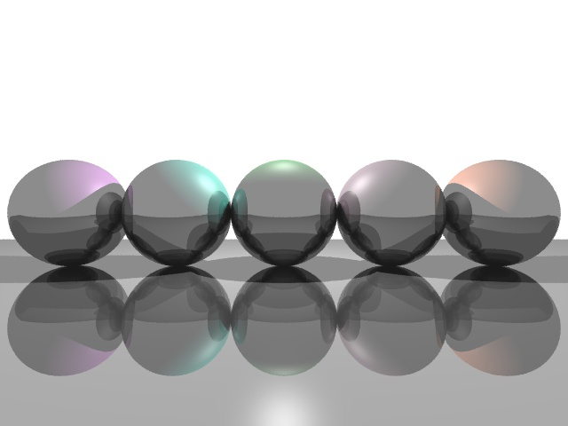
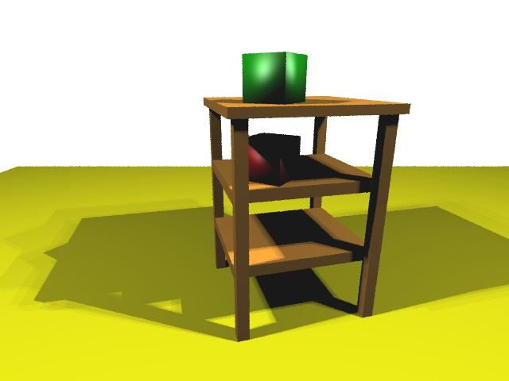

# traycer


A ray tracer.

spheres.scene             | table.scene
:------------------------:|:-----------------------------------:
          | 
10 jittered rays/pixel, 10 reflection bounces | 5 jittered rays/pixel, 10 extra lights/light (for producing soft shadows)

## Features
- Ray-surface intersections with the following surfaces:
  - Triangles
  - Spheres
- Anti-aliasing via jittered supersampling
- Phong shading
- Recursive reflection
- Soft shadows

## Build Requirements
- Operating system: macOS or Linux
- C++ compiler supporting at least C++17
- CMake >= 3.2
- OpenGL >= 3.2

My development environment and tooling:
- Hardware: MacBook Pro (Retina, 13-inch, Early 2015)
- Operating system: macOS Mojave == 10.14.16
- C++ compiler: Clang == 10.0.01
- CMake == 3.25.1
- OpenGL == 4.1

## Build Steps

The build system must be generated before the project can be built. From the project directory, generate the build system:
```sh
mkdir build
cd build
cmake -DCMAKE_BUILD_TYPE:STRING=Release ..
```
The `-G` option is omitted in `cmake -DCMAKE_BUILD_TYPE:STRING=Release ..`, so CMake will choose a default build system generator type based on your platform. To learn more about generators, see the [CMake docs](https://cmake.org/cmake/help/latest/manual/cmake-generators.7.html).

After having generated the build system, go back to the project directory:
```sh
cd ..
```

Build *all* the targets of the project:
```sh
cmake --build build --config Release
```

The built targets are placed in the directory `build`. There is only one executable target: `traycer`.

## Usage
`./build/traycer [options...] <scene file>`

Options:
- `--jitter <number of rays per pixel>`: Enables supersampling via jittering if option argument is greater than 0. Default option argument is 0.
- `--bounces <number of bounces>`: The depth of reflection recursion. Default option argument is 0.
- `--soft-shadows <number of extra lights per light>`: Soft shadows are applied if option argument is greater than 0. Default option argument is 0. 
- `--render-to-file <filepath>`: Rendered image will be written to a JPEG file at the path provided.

To exit the program, have the window in focus and press ESC. You can also terminate the program by pressing CTRL + C in the terminal

The [`scenes`](scenes) directory contains example scene files. 